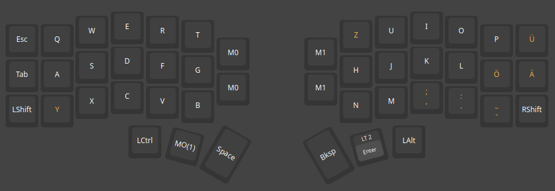
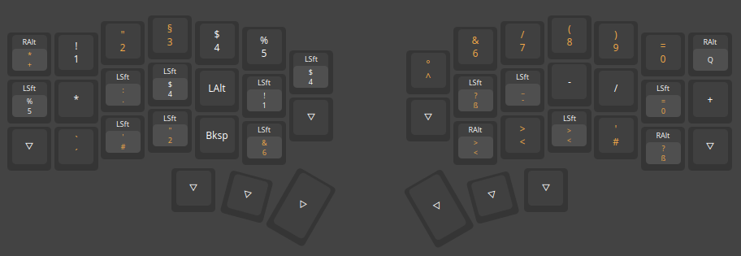
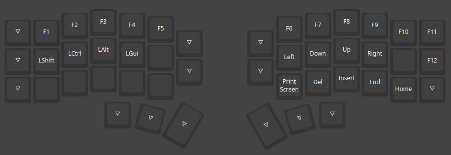
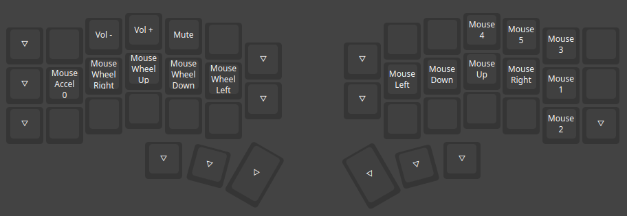
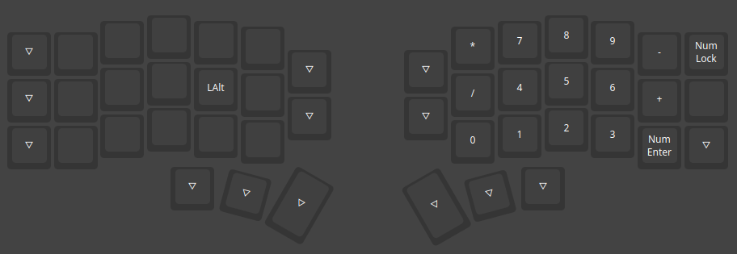
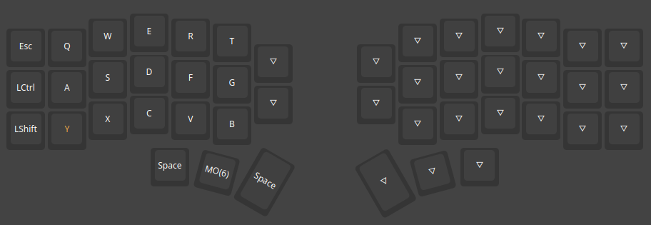
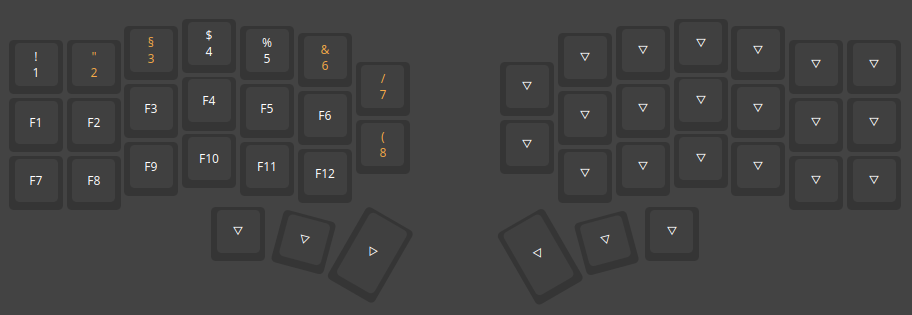

# Pawelgit1234's Vial Keymap

This is my personal [Vial](https://get.vial.today/) configuration for a [Corne Keyboard](https://github.com/foostan/crkbd) (v4).

## The Keymap

### Base Layer

### Symbol Layer

### Functional Layer

### Keyboard and Mouse Layer

### Numpad Layer

### First Game Layer

### Second Game Layer
